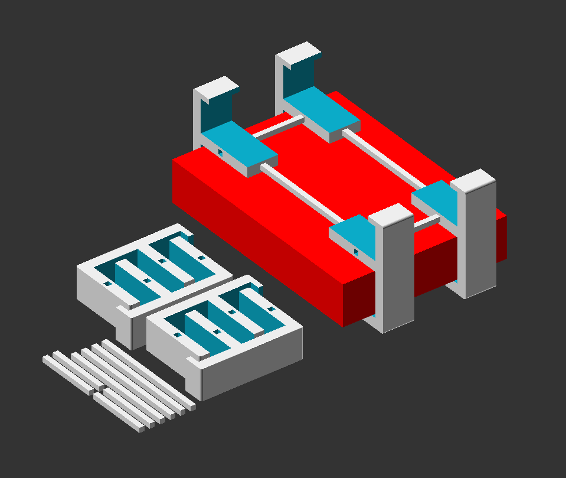

# Device Rack Builder

These are some parts which can be connected together to create a small rack to put in routers, switches or other devices. There also should be enougth air ventilation for the devices.
 
My motivation was to design this rack to be printable on smaller printers like Monoprice Select Mini or Prusa Mini. The file 'all-parts-printable.stl' should be printable on a bed size of about 180mm x 180mm.

 

 

 

 

 

 

 

# LICENSE

<dl>
 Dieses Werk ist lizenziert unter einer <a rel="license" href="http://creativecommons.org/licenses/by/4.0/">Creative Commons Namensnennung 4.0 International Lizenz</a>.
</dl>

<dl>
 This work is licensed under a <a rel="license" href="http://creativecommons.org/licenses/by/4.0/">Creative Commons Attribution 4.0 International License</a>.
</dl>
